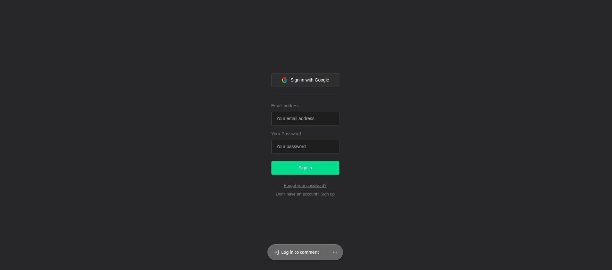
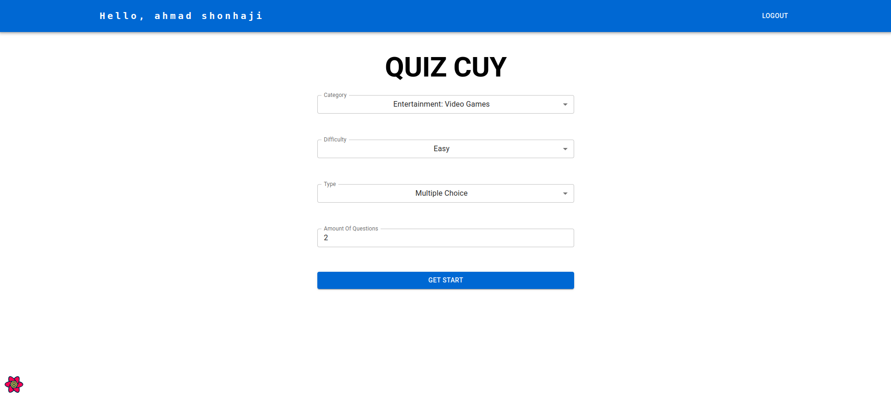
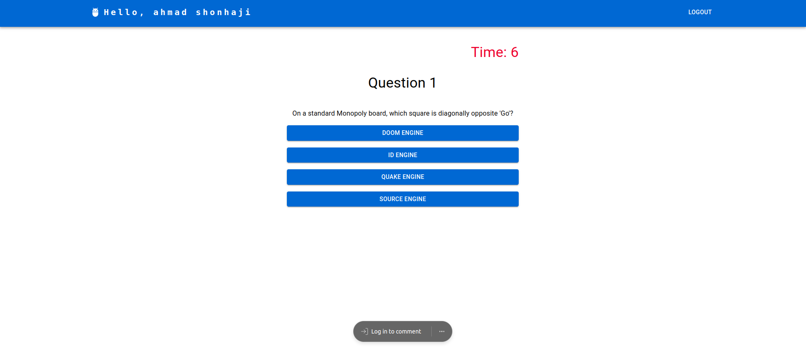
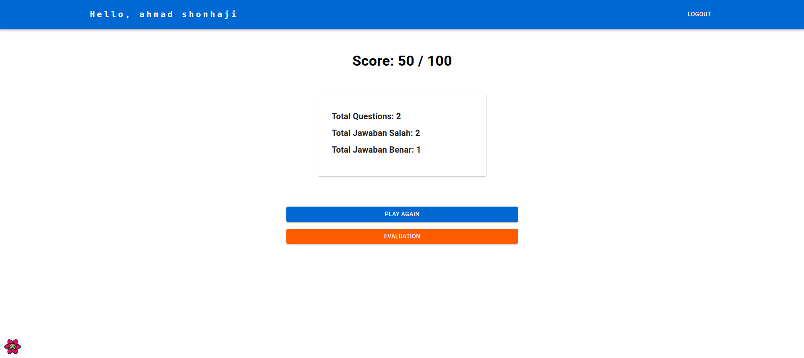
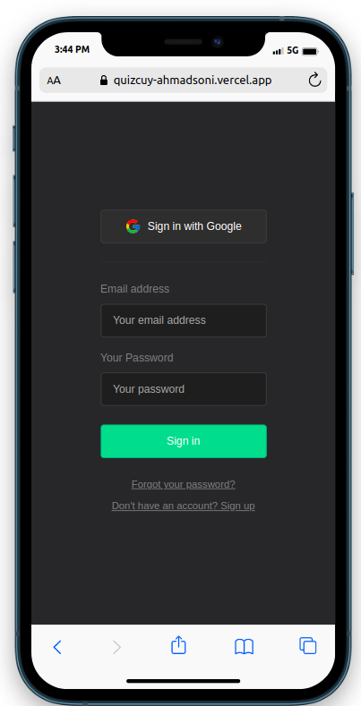
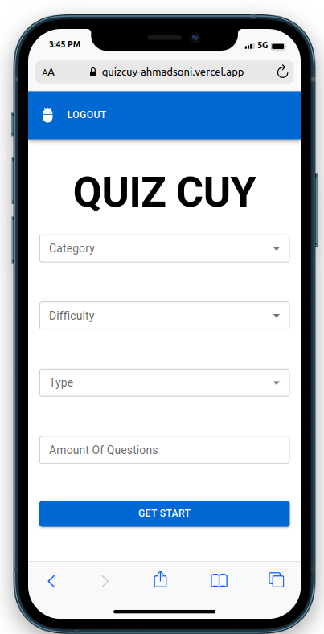
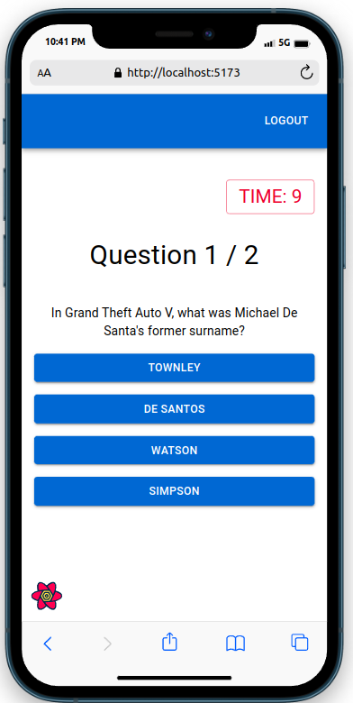
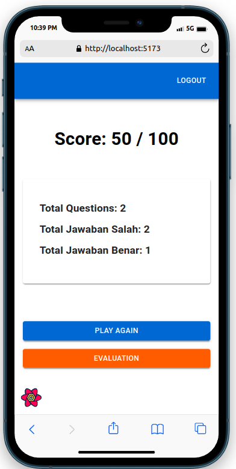

# QUIZ APPS

<div align="center">
  <h2> Teknologi : 🕵️‍♂️ typescript - React JS + Material UI + Redux</h2>
  <hr>
  <p>Project penugasan Magang DOT Indonesia</p>

[](https://github.com/ahmadsoni/QuizCuy-ReactJS)
[](https://depfu.com/ahmadsoni/QuizCuy-ReactJS?project_id=30160)

</div>
# Fitur
Repositori ini dikemas dengan teknologi :
- ⚛️ React 18
- ✨ TypeScript
- 💨 Material UI
- 📈 Auth using supabase
- 📦 Redux
- 🎯 React Query
- 🤖 API using Open trivia api
- ⌛ Time Quiz
- 📃 Count Quiz
- 📊 Score Quiz

## Cara Menjalankan

### 1. Clone landing page ini menggunakan cara berikut:

You can start the server using this command:

```bash
git clone https://github.com/ahmadsoni/QuizCuy-ReactJS.git
npm install
```

### 3. Run program :

```bash
npm run dev
```

### 3. Buka Link Local :

👉 🔗 http://localhost:5173/ 👈

<hr>
## Link Akses Dan Preview

👉 🔗 https://quizcuy-ahmadsoni.vercel.app/quiz/👈

👉 🖥️ Versi Desktop
<div align="center">





</div>
👉 📱 Versi Mobile
<div align="center">




</div>
